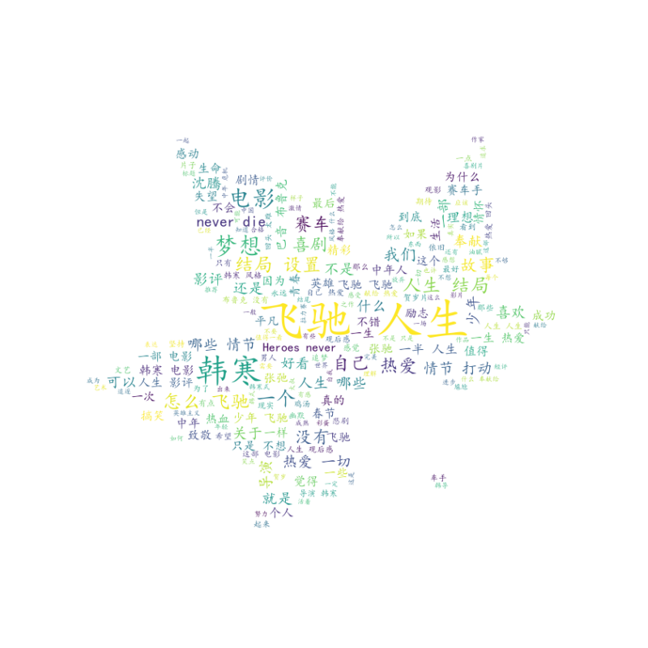
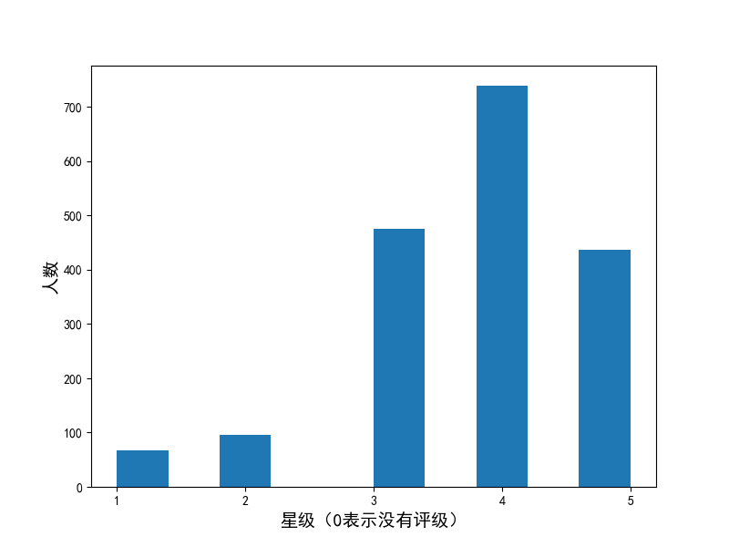
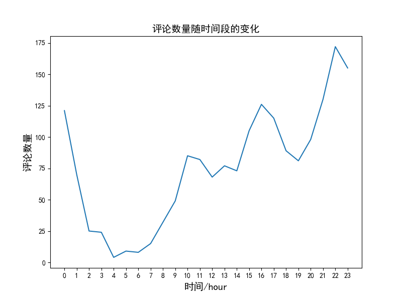
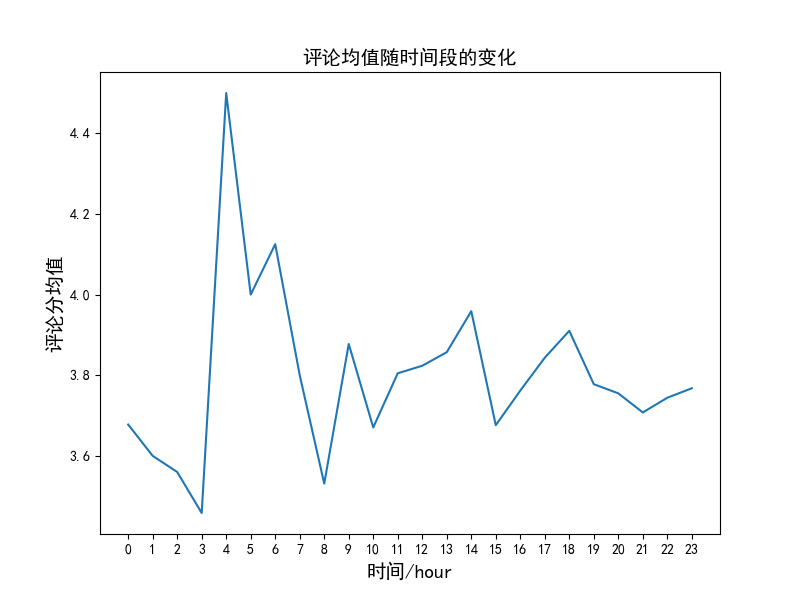

## 数据特征工程实战（简易版）

### 概览

* 该项目较为简单，新手需配好**python**环境。作者使用 **python**进行开发，**jupyter notebook** 作为编辑器。
* 学习该项目您能对爬虫、数据分析与数据可视化等知识获得初步了解。
* **result_images**是存储可视化图片的文件夹

### 运行

* 先安装**python**包

```python
      pip install -r requirements.txt
```

**两种方式运行**：

1. 运行**py**文件

```python
       python main.py
```

2. 或使用**jupyter notebook**

下载**Anaconda**，将**jupyter notebook**调出，打开**main.ipynb**文件，运行即可。

### 实现过程

1. **数据获取**：从豆瓣《飞驰人生》评论页获取数据

2. **数据清洗**：清洗掉获取数据中的脏数据

3. **数据处理**：将有价值的数据提取出来，使用numpy及pandas库进行分析建模

4. 具体详情，转至 [我的博客](https://blog.csdn.net/weixin_41466575/article/details/105303376)

### 效果展示




<p align="center">
Figure 1：词云图
</p>



<p align="center">
​Figure 2：电影评级图
</p>



<p align="center">
​​Figure 3：评论数量图
</p>



<p align="center">
​​​Figure 4：评论均值图
</p>