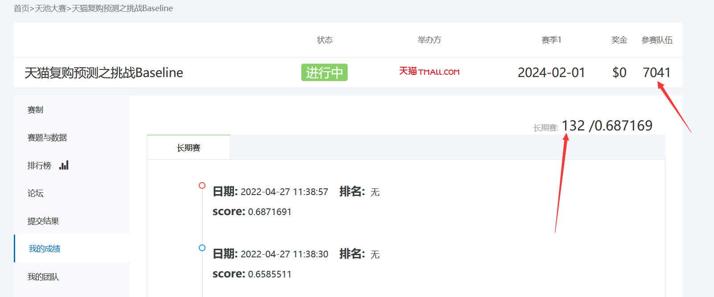

## Introduction

A project to predict the repeat buy rate for Tianmao. The task is open for everyone in Tianci platform. Although, it's a learning contest, it does not mean simple. In this project, we are ranked **132th** among **7,041** teams which obtained **0.6871** for metric **AUC**.

Dataset can be download on [阿里云天池之天猫复购率预测](https://tianchi.aliyun.com/competition/entrance/231576/introduction?lang=zh-cn)


datasets position and structure


## Overview

We divided the predict task into four parts: 1. exploring data 2. feature engineering 3. create model 4. model optimization

1. **Exploring data**: In this part, we just use some basic usage of pandas and plot some intuitive graphs to make us more familiar with the data. Actually, we do nothing operation to the origin data during the time.
2. **Feature engineering**: If we want to predict whether someone will buy the same merchant's product, it's crucial to dive into the behavior of users and merchants. After we know the behavior pattern of users and merchant, we shall dig into the connection of the two objects which means we should covert these infomation to numerical data in the field of data analysis.
3. **Create model**: Just like a combination punch from WTF pro boxers, we use the Logistic, SVM, KNN, Desition Tree, Naive bayes, Bagging of DT(RandomForest), Boosting of DT(GDBT,XGBoost) for predition tasks in the machine learning. In this section, we build all kinds of model like above and judge which one is the best.
4. **Model optimization**: Owing to the imblance of position/negative samples, we make three optimization schemes: Ensemble model, Smote over-sampling and Neural network.

## Before learning

1. **What you should knew ?**

* Data analysis tool: numpy, pandas.
* Machine learning tool like **sklearn** and principle of basic machine learning algorithms.  

2. **Install library before running**:

```python
pip install -r requirements.txt
```

If you cannot install some libraries like **imblearn** or **torch**, it doesn's matter. Just go ahead, we use them in the part four (Model optimization). 

## Some figures



