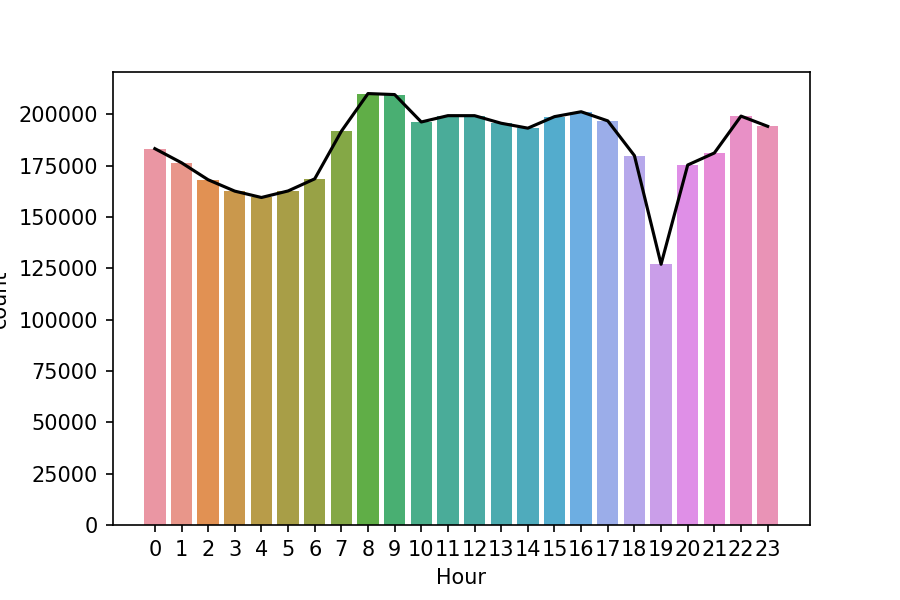
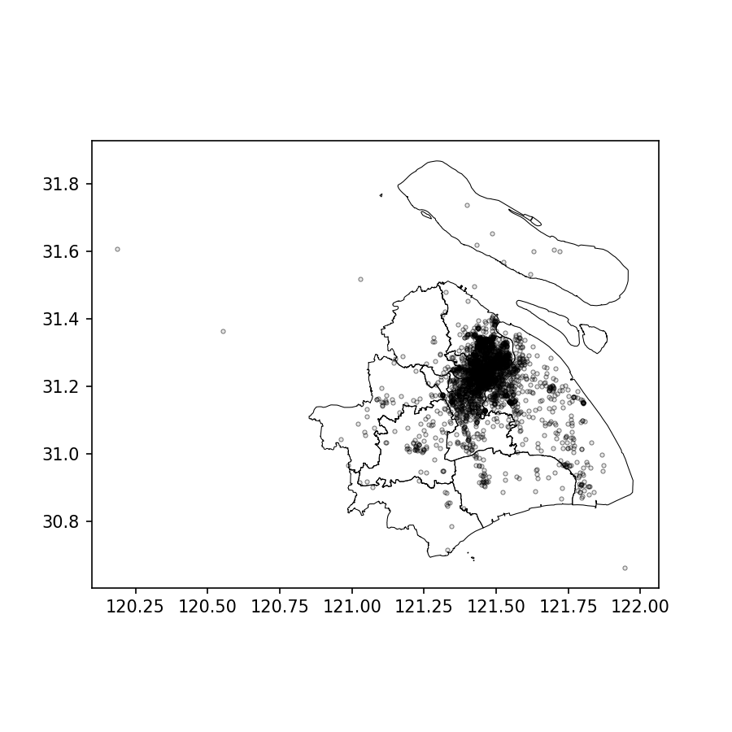
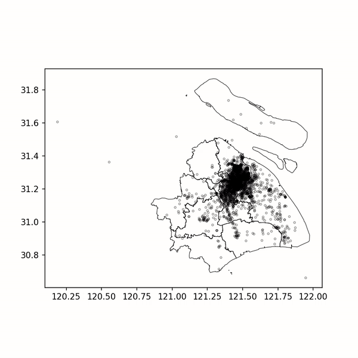
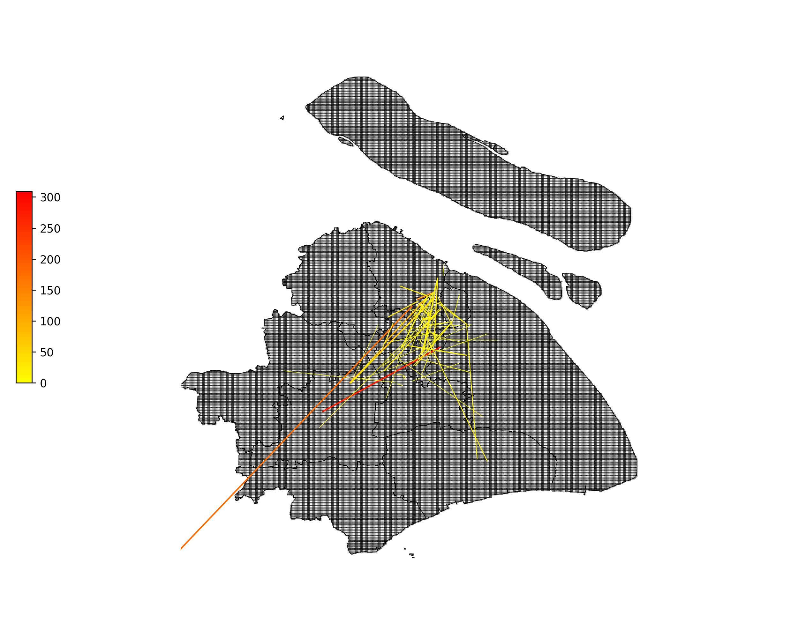
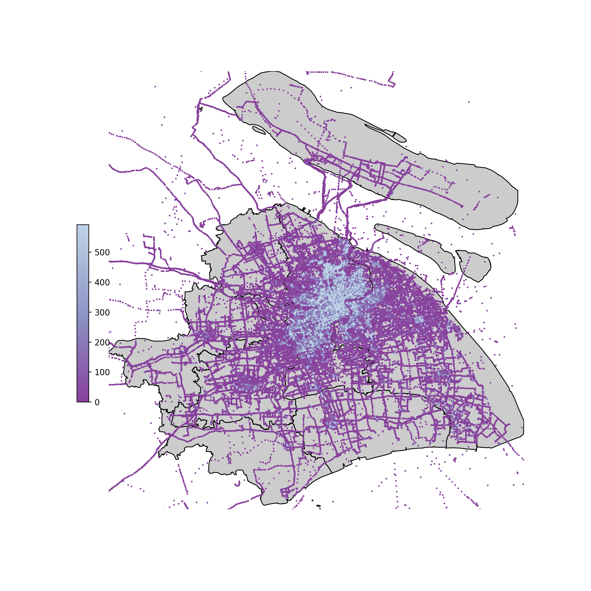

# shanghai_spatial_data_analysis

## Introduction

A standard procedure to deal with the spatial data (the taxi data of shanghai). We get the Shanghai's taxi data from [上海市出租车数据集](http://www.cse.ust.hk/scrg/taxi.tar.gz) (a open source dataset). 

**In this project, you will learn**:

1. How to carry on data analysis.
2. How to handle the data and dive out the intriguing feature which may be useful for business strategy and optimization.
3. How to show the spatial data in the map intuitive.

**The Prior knowledge that you should know**:

1. Data analysis tool: numpy, pandas, geopandas, shapely.
2. Be patient, positive and keep going.

## Run

To run the code efficiently on your computer, you shall do like below:

1. **install the corresponding library**.

```
pip install -r requirements.txt
```

If you can not install successfully, that must be the version conflict. So try to read this video [geopandas的安装](https://www.bilibili.com/video/BV1A5411a7xz?p=11).

2. **Download the** [上海市出租车数据集](http://www.cse.ust.hk/scrg/taxi.tar.gz) **and put into ./data-sample/taxi_sh/***.


3. **Then, begin to learn according to the number's order of ipynb files. So let's begin from the shanghai_data_analysis_1.ipynb.**

## Figure show



<p align="center" >
  <b>1.Taxi's numbers for each hour</b>
</p>



<p align="center" >
  <b>2.The position distribution of taxi in the early morning</b>
</p>



<p align="center" >
  <b>3.The gif for postion distribution in each hour</b>
</p>



<p align="center" >
  <b>4.Start to end distribution</b>
</p>



<p align="center" >
  <b>5.Heat map for position distribution of taxi</b>
</p>